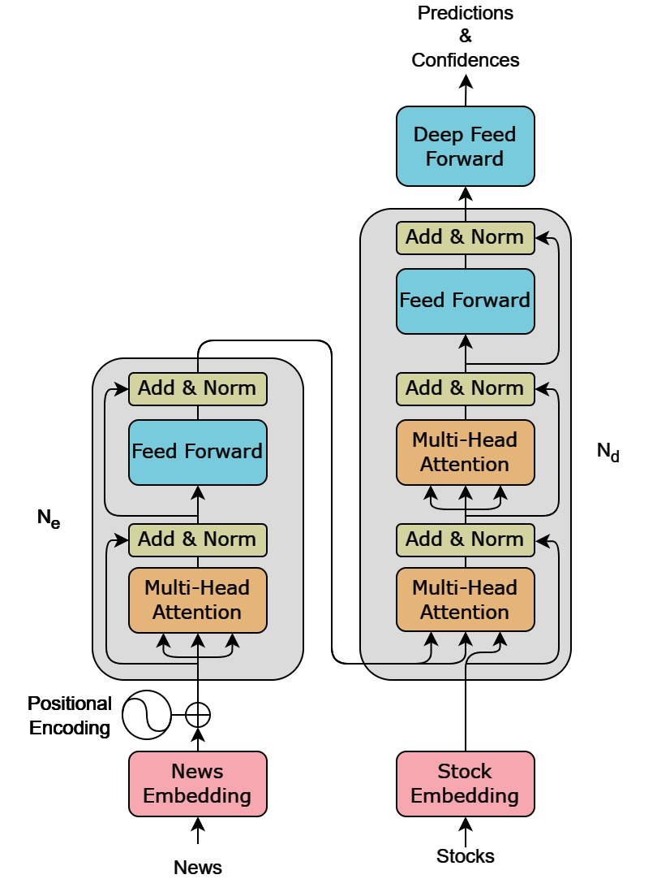

# NSCAN: News-Stock Cross-Attention Network

NSCAN is a novel deep learning model for predicting multiple stock returns simultaneously using financial news data and cross-attention mechanisms. Unlike traditional approaches that predict returns for individual stocks in isolation, our model captures cross-asset relationships and market interactions.



## Features

- Multi-stock return prediction using novel transformer-based architecture
- Uses stock embeddings to flexibly handle multi-stock prediction
- Cross-attention mechanism allows each stock embedding to attend to (potentially different parts of) the news article
- Self-attention mechanism allows the stock embeddings to attend to each other, learing cross-asset relationships and how these interactions may depend on the news
- Built on the Differential Transformer architecture for improved performance in low signal-to-noise ratio environments
- Integrated backtesting framework for strategy evaluation

## Installation

1. Clone the repository:

```bash
git clone https://github.com/CalebMaresca/nscan.git
```

1.5. If you are planning on running the code in an HPC environment which supports singularity, we recommend using a singularity container and overlay.
The overlay can be downloaded from [here](https://drive.google.com/file/d/1sljO9N2RlG9KtU_HplpheeQIWpIf7efs/view?usp=drive_link).

2. Install the package and its dependencies:

```bash
cd nscan
pip install -e .
```

3. Add data:

Due to licensing restrictions, we cannot publically share the data used in this project. Please contact Caleb Maresca at calebmaresca@gmail.com for more information.

4. Set up wandb API key:

To train the model or perform hyperparameter tuning, you will need to set up a wandb API key. From the root of the repository, run:

```bash
echo "<your wandb API key here>" > .wandb_key
```

## Usage

To perform hyperparameter tuning, run:

```bash
sbatch tune.sh
```

To train the model with specific hyperparameters, run:

```bash
sbatch train.sh
```

By default, training will use hyperparameters from the best performing hyperparameter tuning run. If you want to train with specific hyperparameters, you can do so by editing the `src/nscan/training/train.py` script.

`tests/analyze_results.ipynb` evaluates the model on the test set and analyzes the results.

__NOTE:__ This project is in early stages of development.

## Citation

bibtex
@misc{maresca2024nscan,
author = {Maresca, Caleb and Asati, Nishant},
title = {NSCAN: News-Stock Cross-Attention Network},
year = {2024},
publisher = {GitHub},
url = {https://github.com/calebmaresca/nscan}
}

## Acknowledgments

This project builds on the Differential Transformer implementation from [microsoft/unilm](https://github.com/microsoft/unilm/tree/master/diff-transformer), which was introduced in the paper ["Differential Transformer: A New Architecture for Efficient Language Understanding"](https://arxiv.org/abs/2410.05258).